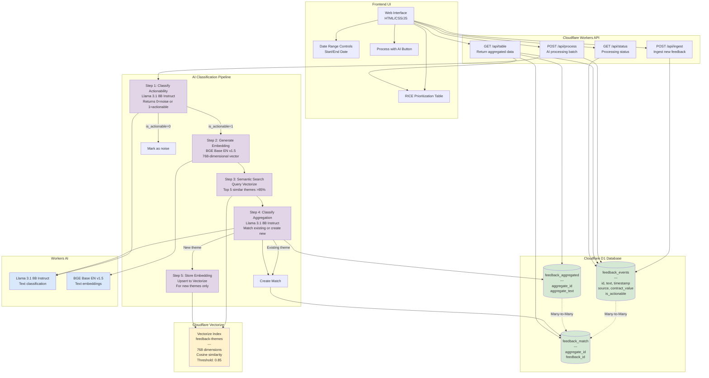

# Feedback Consolidation System - Architecture Diagram

## System Architecture Overview

### Components

**Frontend Layer**
- Single-page web application with date range controls and RICE prioritization table
- Real-time status updates and AI processing progress indicators

**API Layer (Cloudflare Workers)**
- `/api/ingest` - Accepts new customer feedback from multiple sources
- `/api/process` - Triggers AI batch processing (max 10 items to avoid 30s timeout)
- `/api/table` - Returns aggregated feedback with RICE metrics
- `/api/status` - Returns processing status and unprocessed count

**AI Processing Pipeline**
1. **Actionability Classification** - Filters out noise using Llama 3.1 8B
2. **Embedding Generation** - Creates 768-dimensional vectors using BGE model
3. **Semantic Search** - Queries Vectorize for similar existing themes (>85% similarity)
4. **Aggregation Classification** - Groups feedback into themes (supports many-to-many)
5. **Embedding Storage** - Stores new theme embeddings in Vectorize for future matching

**Data Layer**
- **D1 Database** - Three tables with many-to-many relationships via junction table
- **Vectorize** - Vector database for semantic similarity search of aggregated themes

**AI Models (Workers AI)**
- **Llama 3.1 8B Instruct** - Text classification and aggregation
- **BGE Base EN v1.5** - 768-dimensional text embeddings

### Data Flow

1. **Ingestion**: Customer feedback → `feedback_events` table (is_actionable=NULL)
2. **Processing**: Batch processing classifies actionability and aggregates similar feedback
3. **Aggregation**: Creates or matches aggregated themes with semantic search assistance
4. **Storage**: Stores matches in junction table and embeddings in Vectorize
5. **Display**: UI queries aggregated data with RICE scoring for prioritization

### Key Design Features

- **Incremental Processing**: Feedbacks processed once, never reprocessed
- **Many-to-Many Relationships**: Single feedback can relate to multiple themes
- **Semantic Similarity**: Vectorize reduces duplicate theme creation
- **AI Hallucination Prevention**: Validates aggregate_ids before creating matches
- **Batch Processing**: Max 10 items per request to avoid Worker timeouts
- **Date Range Filtering**: All queries filtered by user-selected timeframe
