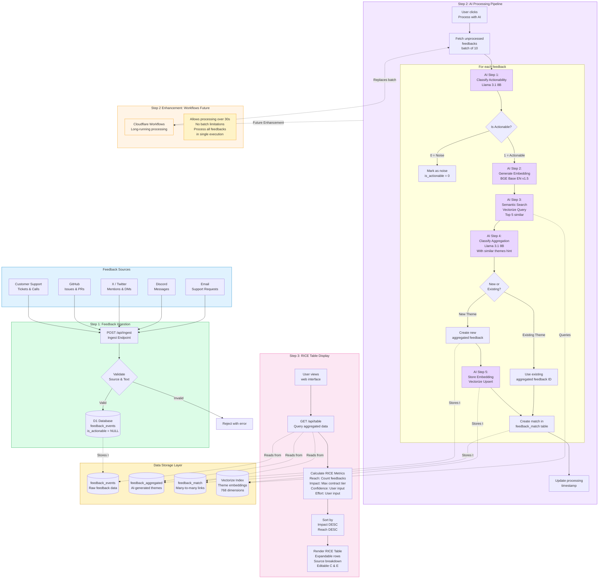

# Feedback Processing Flow Diagram

This diagram shows the complete end-to-end flow from feedback sources to the RICE prioritization table.

## Flow Description

### Step 1: Feedback Ingestion
1. **Feedback Sources** send data via POST request to `/api/ingest`
2. System validates source type (CS, GitHub, X, Discord, Email) and text content
3. Valid feedback stored in `feedback_events` table with `is_actionable = NULL`

### Step 2: AI Processing Pipeline (Current Implementation)
**User triggers processing** by clicking "Process with AI" button:

1. **Fetch Batch**: Query up to 10 unprocessed feedbacks from date range
2. **For Each Feedback:**
   - **AI Step 1**: Classify actionability (0=noise, 1=actionable)
   - **If Noise**: Mark `is_actionable = 0`, exclude from aggregation
   - **If Actionable**:
     - **AI Step 2**: Generate 768-dimensional embedding
     - **AI Step 3**: Search Vectorize for similar themes (>85% similarity)
     - **AI Step 4**: Classify aggregation (with similar themes as hints)
     - **If New Theme**: Create aggregated feedback entry
     - **AI Step 5**: Store embedding in Vectorize
     - **If Existing Theme**: Validate ID exists
     - **Create Match**: Link feedback to theme(s) in junction table
3. **Update Status**: Record processing timestamp

**Limitation**: 30-second Worker timeout requires batch processing (max 10 items)

### Step 2 Enhancement: Cloudflare Workflows (Future)
**Purpose**: Remove batch limitations for seamless processing

**Benefits**:
- **No timeout constraints**: Process hundreds of feedbacks in single execution
- **No manual clicking**: Automatic processing of all unprocessed items
- **Better UX**: Users don't need to click "Process with AI" multiple times
- **Scalability**: Handle large feedback volumes automatically

**Implementation**: Replace batch-based processing with Workflows for long-running AI classification

### Step 3: RICE Table Display
1. **User views interface** at deployed Worker URL
2. **GET /api/table** queries aggregated data filtered by date range
3. **Calculate RICE Metrics**:
   - **Reach**: Count distinct feedback events per theme
   - **Impact**: Maximum contract value tier (1.0-5.0)
   - **Confidence**: User-editable dropdown (50%, 80%, 100%)
   - **Effort**: User-editable dropdown (1-5)
   - **RICE Score**: `(Reach × Impact × Confidence) / Effort`
4. **Sort Results**: By Impact DESC, then Reach DESC
5. **Render Table**: Interactive UI with expandable rows, source breakdown, editable scores

## Data Flow Through Storage
- **Ingestion** → `feedback_events` (raw feedback)
- **AI Processing** → `feedback_aggregated` (themes) + `feedback_match` (links)
- **Embedding Storage** → `Vectorize` (semantic search index)
- **Display** → Reads all three tables + calculates RICE scores in real-time

## Key Features
- **Many-to-Many**: Single feedback can relate to multiple themes
- **Semantic Similarity**: Vectorize reduces duplicate theme creation
- **Incremental Processing**: Feedbacks never reprocessed once classified
- **AI Hallucination Prevention**: Validates aggregate IDs before creating matches
- **Date Range Filtering**: All queries filtered by user-selected timeframe
